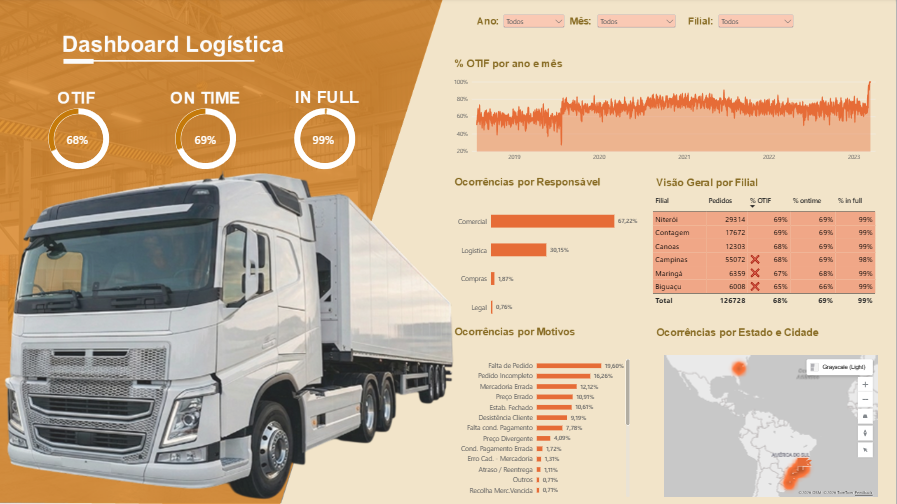

# 📦 BI Logística

> Painel de Business Intelligence para acompanhamento e análise de indicadores logísticos: entregas, prazos e desempenho operacional.

<!-- EDITE: ajuste a frase acima com o objetivo real do seu projeto -->

<!-- EDITE: troque "Power BI" pela ferramenta que você usa (Tableau, Looker Studio, Metabase, Python...) -->

---

## 🔗 Acesse o dashboard online

## 📌 Sobre o projeto

Este projeto é um dashboard de Business Intelligence que consolida indicadores de desempenho logístico — como OTIF (On Time In Full), % de entregas no prazo, % de entregas completas, ocorrências por motivo/responsabilidade e distribuição geográfica de entregas por cidade e estado. O painel foi criado como peça de portfólio, mas também pode ser usado por gestores e times de operações logística para acompanhar prazos, filiais e causas de atraso ao longo do tempo. Os dados foram estruturados em um modelo relacional com tabelas de Pedidos, Calendário e Medidas (DAX), permitindo filtros por período e por filial.

<!-- EDITE: confirme a origem real dos dados (planilha, banco de dados, dataset público ou dados simulados) -->

## 🎯 Problema de negócio

O dashboard responde às principais perguntas de gestão logística que a empresa precisa acompanhar:

- Qual o percentual de entregas realizadas dentro do prazo e de forma completa (OTIF)?
- Como estão evoluindo os indicadores de % no prazo e % de pedidos completos ao longo do tempo?
- Quais são os principais motivos das ocorrências que impactam as entregas?
- Qual área é a maior responsável pelas ocorrências registradas (comercial, logística, compras etc.)?
- Em quais estados e cidades se concentram as ocorrências de entrega?
- Como cada filial está performando em relação aos indicadores de prazo e completude?

## 📊 Indicadores (KPIs)

| Indicador | Descrição | Fórmula / Regra |
|---|---|---|
| OTIF (On Time In Full) | % de entregas no prazo e completas | Entregas OTIF ÷ Total de entregas |
| Lead time médio | Tempo médio entre pedido e entrega | Média (data entrega − data pedido) |
| Taxa de devolução | % de pedidos devolvidos | Pedidos devolvidos ÷ Total de pedidos |
| Taxa de atraso | % de entregas fora do prazo | Entregas atrasadas ÷ Total de entregas |

<!-- EDITE: mantenha apenas os KPIs que existem no seu projeto -->

## 🛠 Tecnologias

- **Visualização:** Power BI 
- **Tratamento de dados:** Power Query
- **Modelagem:** Modelo estrela (fato + dimensões)
- **Versionamento:** Git e GitHub

## 🖼 Prévia do dashboard

> 👆 Clique na imagem para abrir o dashboard interativo.

## 💡 Principais insights

- Insight 1: descreva um achado relevante dos dados (ex.: "a região X concentra 40% dos atrasos").
- Insight 2: ...
- Insight 3: ...

## 👤 Autor

**Kayky Pramos**

- GitHub: [@KaykyPramoshttps](https://github.com/KaykyPramoshttps)
- LinkedIn: [Kayky Pereira Ramos](https://www.linkedin.com/in/kayky-pereira-ramos-180770274)
